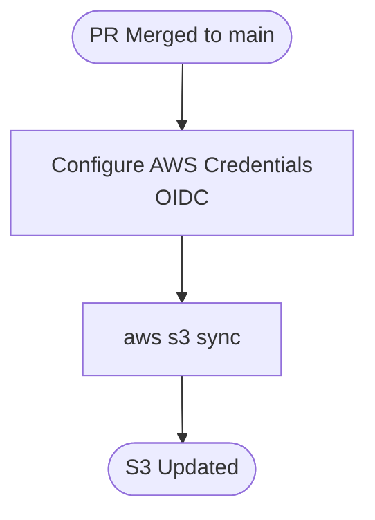

# S3 Sync Pipeline

GitHub Actions pipeline to automatically sync repository contents to an AWS S3 bucket on every push to main.

## Pipeline Overview



## Jobs

### Sync
Checks out the repository and syncs all files to the configured S3 bucket using `aws s3 sync`. Any files present in S3 that no longer exist in the repository are automatically removed via the `--delete` flag.

## Triggers

The pipeline runs on pushes to `main`, excluding the following file types:

| File pattern | Description |
|---|---|
| `**.md` | Documentation — changes here don't affect S3 contents |
| `.github/**` | Workflow files — changes here don't affect S3 contents |

## Prerequisites

### AWS Authentication
The pipeline authenticates to AWS using OIDC — no long-lived credentials are stored in GitHub. You will need to:

1. Create a GitHub OIDC provider in your AWS account
2. Create an IAM role with a trust policy scoped to this repository
3. Store the role ARN in GitHub Secrets as `AWS_ROLE_ARN`

### S3 Bucket
Update the `aws s3 sync` command in `sync.yml` with your bucket name before use:

```yaml
- run: aws s3 sync . s3://your-bucket-name --delete --exclude ".git/*"
```

## Local Development

Test the sync locally using the AWS CLI. Swap `--delete` for `--dryrun` to preview what would be uploaded or removed without making any changes:

```bash
aws s3 sync . s3://your-bucket-name --dryrun --exclude ".git/*"
```
