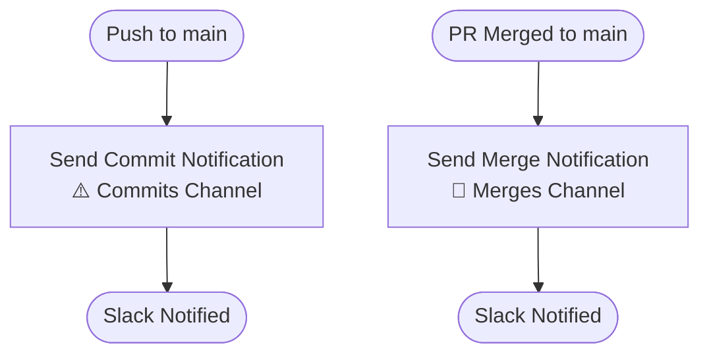

# Slack Notifications Pipeline

GitHub Actions to send Slack notifications on commits and merges to main.

## Pipeline Overview



## Jobs

### Notify Slack — Commit
Fires on every push to main. Sends a notification to the commits channel including the author, branch, commit message, and a link to the commit on GitHub.

### Notify Slack — Merge
Fires when a PR is merged to main. Sends a notification to the merges channel including the PR title, author, who merged it, and a link to the PR on GitHub. Closed PRs that were not merged do not trigger a notification.

## Triggers

| Event | Condition | Job triggered |
|---|---|---|
| `push` | Branch is `main` | Commit notification |
| `pull_request` closed | Branch is `main` and PR was merged | Merge notification |

## Prerequisites

### Slack Incoming Webhooks
Each channel requires its own Incoming Webhook URL. To set them up:

1. Go to [https://api.slack.com/apps](https://api.slack.com/apps) and create a new app
2. Enable **Incoming Webhooks** and add a webhook for each channel
3. Store the webhook URLs in GitHub Secrets as follows:

| Secret | Description |
|---|---|
| `SLACK_COMMIT_WEBHOOK_URL` | Webhook URL for the commits channel |
| `SLACK_MERGE_WEBHOOK_URL` | Webhook URL for the merges channel |

## Local Development

Test a webhook URL locally using curl before adding it to GitHub Secrets:

```bash
curl -s -X POST "https://hooks.slack.com/services/your/webhook/url" \
  -H "Content-Type: application/json" \
  -d '{"text": "Test notification"}'
```

A response of `ok` confirms the webhook is working correctly.
