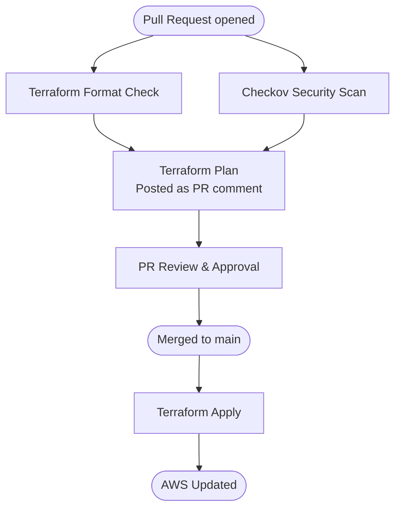

# Advanced Terraform Pipeline

GitHub Actions pipeline to automate the formatting, security scanning, and deployment of Terraform infrastructure to AWS.

## Pipeline Overview



## Jobs

### Terraform Format
Runs `terraform fmt -check -recursive` to ensure all `.tf` files are consistently formatted. If any files fail the check, a comment is posted on the PR with instructions on how to fix it locally.

### Terraform Security
Runs [Checkov](https://www.checkov.io/) to scan all Terraform and IAM JSON files for security and compliance issues. Results are posted as a PR comment if issues are found. This job is non-blocking — the pipeline continues even if Checkov finds issues.

### Terraform Plan
Runs `terraform init`, `terraform validate`, and `terraform plan`. The plan output is posted as a PR comment and updated on each subsequent push to the branch, keeping the comment history clean.

Only runs after both Format and Security jobs complete.

### Terraform Apply
Runs `terraform apply -auto-approve` after a PR is merged to main. Only runs if all prior jobs passed.

## Triggers

The pipeline runs on changes to the following file types:

| File pattern | Description |
|---|---|
| `**.tf` | Terraform configuration files |
| `**.tfvars` | Terraform variable files |
| `**.json` | IAM policy JSON files |
| `.github/workflows/terraform-pipeline.yml` | Changes to the pipeline itself |

## Prerequisites

### AWS Authentication
The pipeline authenticates to AWS using OIDC — no long-lived credentials are stored in GitHub. You will need to:

1. Create a GitHub OIDC provider in your AWS account
2. Create an IAM role with a trust policy scoped to your repository
3. Store the role ARN in GitHub Secrets as `AWS_ROLE_ARN`

### Remote State
Terraform state must be stored remotely so it persists between pipeline runs. Configure an S3 backend in your Terraform before using this pipeline:

```hcl
terraform {
  backend "s3" {
    bucket         = "my-terraform-state"
    key            = "my-project/terraform.tfstate"
    region         = "us-east-1"
    dynamodb_table = "terraform-state-lock"
  }
}
```

## Caching

The pipeline caches the pip download directory to avoid re-downloading Checkov on every run. The cache is stored at the repository level and shared across all PRs and branches.

The cache key includes the current year and week number:

```
checkov-Linux-2026-17
```

This forces the cache to bust every Monday regardless of how active the repository is, ensuring Checkov is updated at least once a week without any manual version pinning. The first run of each week will be a cache miss and will re-download Checkov — all subsequent runs that week will use the cache.

## Comment Search & Replace

By default the pipeline overwrites the Terraform Plan and Checkov comments on every push to a PR, keeping the thread clean with a single up-to-date comment per check.

This is controlled by the `Find Existing ... Comment` steps in `terraform.yml`. If you prefer a fresh comment on every push for a full audit history, comment out the two `Find Existing` steps for the relevant job and replace `create-or-update-comment` with `create-comment`:

```yaml
      # - name: Find Existing Plan Comment
      #   uses: peter-evans/find-comment@v3
      #   id: find_plan_comment
      #   with:
      #     issue-number: ${{ github.event.pull_request.number }}
      #     comment-author: github-actions[bot]
      #     body-includes: Terraform Plan
```

The same pattern applies to the Checkov failure comment in the `security` job.

## Local Development

Format all Terraform files before pushing to avoid a failed format check:

```bash
terraform fmt -recursive
```

Run Checkov locally to catch security issues before opening a PR:

```bash
pip install checkov
checkov --directory . --framework terraform json
```
