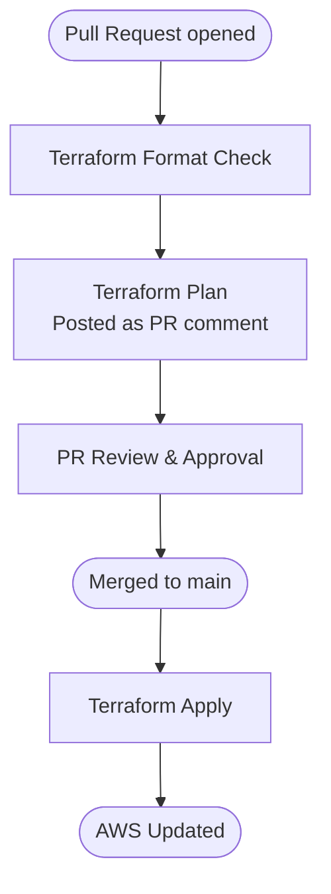

# Simple Terraform Pipeline

GitHub Actions pipeline to automate the formatting, planning, and deployment of Terraform infrastructure to AWS.

## Pipeline Overview



## Jobs

### Terraform Format
Runs `terraform fmt -check -recursive` to ensure all `.tf` files are consistently formatted. If any files fail the check, a comment is posted on the PR with instructions on how to fix it locally.

### Terraform Plan
Runs `terraform init`, `terraform validate`, and `terraform plan`. The plan output is posted as a PR comment on every push to the branch.

### Terraform Apply
Runs `terraform apply -auto-approve` after a PR is merged to main.

## Triggers

The pipeline runs on all pull requests and pushes to `main`, regardless of which files changed.

## Prerequisites

### AWS Authentication
The pipeline authenticates to AWS using OIDC — no long-lived credentials are stored in GitHub. You will need to:

1. Create a GitHub OIDC provider in your AWS account
2. Create an IAM role with a trust policy scoped to your repository
3. Store the role ARN in GitHub Secrets as `AWS_ROLE_ARN`

### Remote State
Terraform state must be stored remotely so it persists between pipeline runs. Configure an S3 backend in your Terraform before using this pipeline:

```hcl
terraform {
  backend "s3" {
    bucket         = "my-terraform-state"
    key            = "my-project/terraform.tfstate"
    region         = "us-east-1"
    dynamodb_table = "terraform-state-lock"
  }
}
```

## Comment Behaviour

This pipeline posts a new Terraform Plan comment on every push to a PR, preserving a full history of how the plan evolved as changes were made. If you prefer a single comment that is overwritten on each push, see the [advanced pipeline](../terraform-pipeline/README.md) which uses `peter-evans/find-comment` and `peter-evans/create-or-update-comment` to manage comments.

## Local Development

Format all Terraform files before pushing to avoid a failed format check:

```bash
terraform fmt -recursive
```